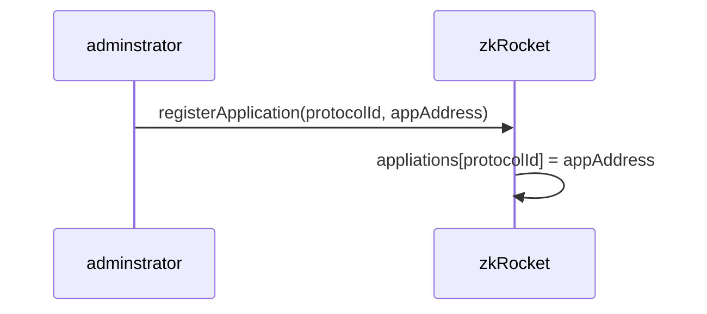
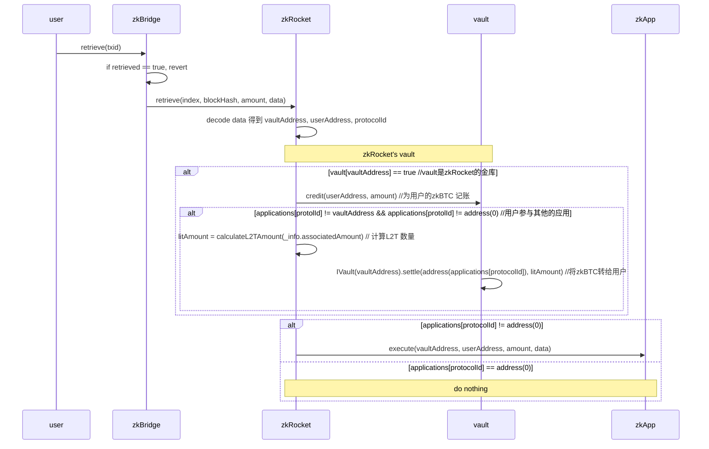

# ZenKeeper
The ZenKeeper Protocol, a protocol for Bitcoin-based assets, based on the zkBTC cross-chain capabilities.

## Vault 合约
Vault 是一个可托管zkBTC资产的金库合约，在deposit时，用于接收过桥的zkBTC 以及奖励的的L2T Token. 该合约提供一个credit和settle接口，
- credit：用于在vault合约中给用户zkBTC记账。
- settle：将vault合约中的L2T转移到别的地址
这两个接口应该只被有特定权限的合约访问，例如zkRocket 或者zkApp
```solidity
    function credit(address _to, uint256 _amount) onlyOperator external {
        require(_to != address(0), "Invalid recipient");
        require(_amount > 0, "Amount must be > 0");
        require (zkBTC.balanceOf(address(this)) >= _amount, "Vault balance too low");
        balances[_to] += _amount;
        emit Credit(_to, _amount);
    }

    function settle(address _to, uint256 _amount) onlyOperator external {
        require(_to != address(0), "Invalid recipient");
        require(_amount > 0, "Amount must be > 0");
        require (l2t.balanceOf(address(this)) >= _amount, "Vault balance too low");
        bool success = l2t.transfer(_to, _amount);
        require(success, "Transfer failed");
        emit Settle(_to, _amount);
    }

```
## zkRockets 合约
zkRocket 处理deposit 交易中OP_RETURN 后的数据
```
                   ｜<----------------------------------zkRockets--------------------------------->|----appData------->
    fields:       OP_REURN     opcode     length      addressA    chainId    protocolId    addressB     appData
    length(bytes):    1           1       0/1/2/4        20            1           2          20         xxx 
```
- addressA: zkBridge 处理deposit时，将过桥的zkBTC 以及奖励的的L2T Token 直接转账到该地址.addressA 3种可能:
   - 用户地址. 此时用户不参与zkRockets 协议。
   - zkRocket 控制的vault 地址。
   - zkRocket 上的应用(例如zkRunes)控制的vault 地址。 
- chainId: 因为支持从BTC 跨链到多条EVM链，用chainId跨链的目标链，0-eth 
- addressB: 用户指定的地址
- appData: zkRocket上的应用协议数据。

zkRocket 要实现如下 retrieve 接口：
```solidity 
 function retrieve(ProvenData calldata info,bytes32 txid ) external;
```
### zkRockets 主要流程

#### 在zkBridge上注册 zkRockets 


#### 在zkRockets上注册应用协议
- aution 在拍卖成功后可以在zkRocket上注册应用。

- zkRocket的adminstrator 也可以直接注册appliction



#### 用户调用zkBridge 的retrieve 函数，触发zkRockets 处理 

## zkRockets 的应用合约
应用合约要实现如下execute 接口：
```solidity 
 function execute(address vaultAddress, addres userAddress, uint256 amount, Provendata data) external;
```

## 测试准备
- deploy zkBTC: 0xeda25EC9CF6BF1800174080CDBddb5779F2F2c1b
- deploy L2T: 0xF04be284E514e18aF2A69cAC6C8977967581E461
- deploy vault: 0xBa633eE041e1854bF42A69578028b247d180583D
- deploy feepool: 0x09feeCff308d1f2fDAD8350257B9eDE28AC7d867
- deploy zkRocket: 0xfb806E2F5590c08Cfdab3c1b9D28600ACc2790c1
- deploy mokcApp: 0x131d73C228BfA36F81f15D3052E0a723427494b0
- deploy 盲盒: 0xEa863A1f265a2D87E4F4B70A4cA8C095ad6AC18b
- zkRocket中添加 mockApp, 协议代号1: https://sepolia.etherscan.io/tx/0xae3a3d6bb32c29434585d7aceabe2ff87cc5b9fb0003d62030f0979b0a7d4eac
- zkRocket中添加 盲盒， 协议代号2: https://sepolia.etherscan.io/tx/0xae3a3d6bb32c29434585d7aceabe2ff87cc5b9fb0003d62030f0979b0a7d4eac
- 将vault 增加到zkRocket中：https://sepolia.etherscan.io/tx/0xd617f0f97b0a5f50c91152d6a16c97591718782d23646d420f7889879f7f7a69

- mint 1000 zkBTC to vault: https://sepolia.etherscan.io/tx/0x3233c69c6423af0e67e486d7ffecc7c70aed0fc9064ec042d1ff8b20e5ce98f8
- mint 128000 L2 to vault: https://sepolia.etherscan.io/tx/0x37ffda118a26003202f60afadaa68c431115c447fb0f73482e456234e982505c

- 将zkRocket 设置为vault 的OPERATOR_ROLE： https://sepolia.etherscan.io/tx/0xb637113059035b0815d58e8d97a304010c04a96f3e60e87932206ca406d2b2ea

- 将EOA owner 设置为zkRocket的BRIDGE_ROLE ：https://sepolia.etherscan.io/tx/0xb177b0ecbea749fcdc2d2241a336f467d9d0a6e59ade86e012201fbbb2ce94c8


