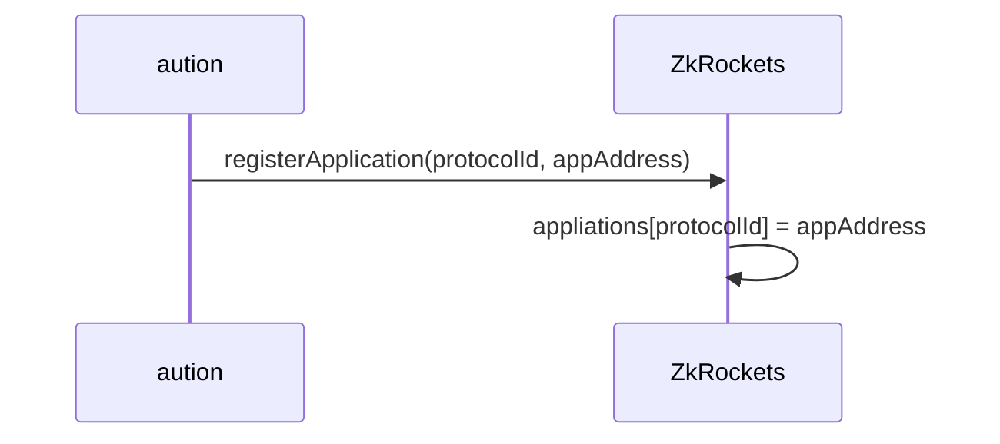
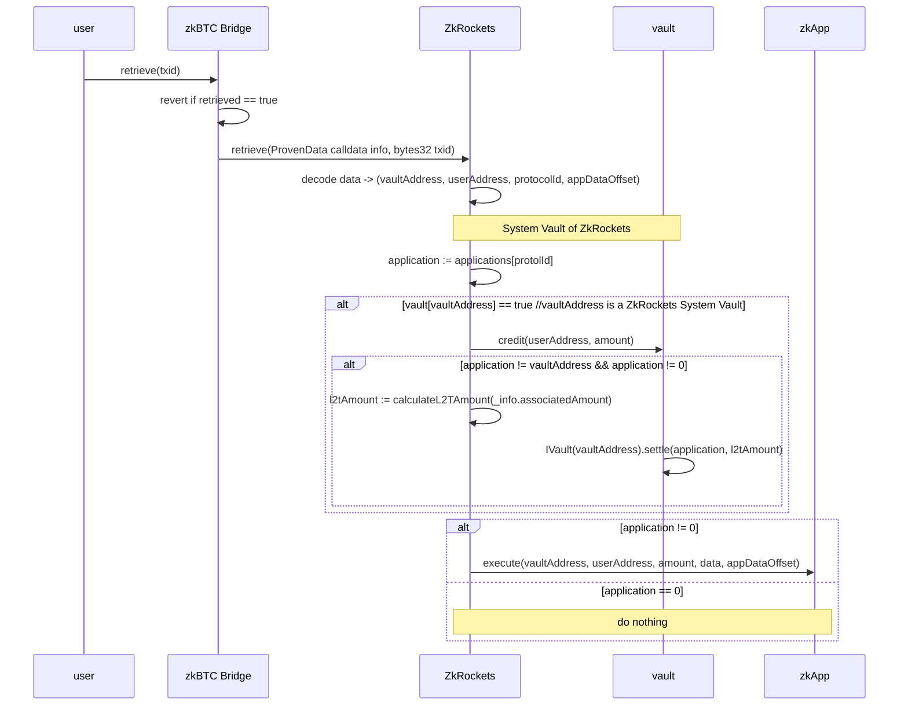

# ZenKeeper
The ZenKeeper Protocol is a cross-chain protocol for Bitcoin-based assets, based on the zkBTC bridge.

## the ZenKeeper Protocol and its Data Format
The [zkBTC Bridge](https://apps.zkbtc.money/?mode=bridge) enables users to bring bitcoin to Ethereum. User simply deposit to the designated operator address with an additional output:
```
OP_RETURN(0x6a) || 0x14(meaning 20 bytes to follow) || recipient_address_eth(20 bytes)
```
The `OP_RETURN` output simply contains user's recipient address for the minted zkBTC tokens. It should be the original address in 20 bytes, not hex-encoded or `0x-` prefixed.

When more data are encoded in the deposit transaction, we could prove these additional dato to some Ethereum smart contracts. This is the idea behind the ZenKeeper protocol. 

The ZenKeeper protocol defines three additional roles:
- `ZkRockets`: the smart contract that implements the ZenKeeper protocol and handles those cross-chain data;
- `Vaults`: the smart contracts that could manager users zkBTC assets;
- `Applications`: the smart contracts that could perform certain functionalities, identified by a protocol Id.

Now the `OP_RETURN` output should contain data in the below format:
```
                        ｜<----------------------------------ZkRockets-------------------------------------------------->|----Application Data------->
    fields:              OP_REURN     op_pushbytes_x    length      vaultAddress    chainId    protocolId    userAddress     appData
    length (in bytes):    1           1                 0/1/2/4        20            1           1+x             20             xxx 
```
- **op_pushbytes_x** and (optional) length: this is how data length is encoded in the `OP_RETURN` output. When data length is not more than 75 (bytes), the op_pushbytes_x along tells the actual length (`x`) of data that follows. Over 75, then 1 or 2 or 4 bytes are used to encode the actual length in little-endian fashion. See [op_return](https://learnmeabitcoin.com/technical/script/return/) and [data push](https://learnmeabitcoin.com/technical/script/#data) for more information.
- **vaultAddress**: this is actually the `recipient address in eth` when purely depositing. The zkBTC Bridge contract transfers the minted zkBTC tokens to this address, along with rewarded L2T. Although this happens out of `ZkRockets`'s scope, it is `ZkRockets`'s job to ensure the correct handling of users' assets. So the vault contracts must implement the `credit` and `settle` functions for these two purposes.
- **chainId**: ZkRockets supports multiple chains, and `0` means Ethereum.
- **protocolId**: the assigned Id for a vault or application. Follow the same encoding rules of [data push](https://learnmeabitcoin.com/technical/script/#data) and let `id` denote the protocolId value:
    - value in range 1~75: `1 byte of OP_PUSHBYTES_X with X := id`;
    - value in range 76~255: `0x4C || id`;
    - value in range 256~65535: `0x4D || id % 256 || id >> 8`;
    - value in range 65536~: `0x4E || id % 256 || (id>>8) % 256 || (id>>16) % 256 || id >> 24`.
- **userAddress**: user's recipient address
- **appData**: application data

## the ZkRockets Contract
The ZkRockets contract is called by the zkBTC Bridge contract:
```solidity 
 function retrieve(ProvenData calldata info, bytes32 txid) external onlyBridge;
```

For the purposes of: 
- parse the data encoded in the `OP_RETURN` output;
- if the address of a managed vault is present as `vaultAddress` (following the length codes) in the proven data, call the `credit` funciton to book-keep the owner of the bridged zkBTC as `userAddress`, and the `settle` function to forward the L2T rewards to the application identified in `protocolId`;
- invoke application's `execute` function.

Users are responsible for sending in the `OP_RETURN` data so users are ultimately responsible for their assets to be taken care of. All vault contracts must be open-sourced and carefully reviewed before it could be managed by the ZkRockets contract.

There are 3 possibilities for the `vaultAddress`:
   - system vault, managed by the ZkRockets contract;
   - application vault or the application itself;
   - user's own address.

In most cases, the `vaultAddress` and the `protocolId` refer to the same smart contract. Yet, user might, and ZkRockets allows to involve two seperate contracts at the same time: sending zkBTC tokens to one vault, then interact with another application. That's why all vaults must have `credit` and `settle` functions, and all applications must have `execute` function -- these functions serve different purposes.

Specifically:

- the `credit` function credit a proper amount of zkBTC to the `userAddress`;
- the `settle` function usually sends back the rewarded L2T to the application as identified by `protocolId`;
- the `execute` function performs whatever functionality defined by the application as identified by `protocolId`.

### Vault Composability
Since the zkBTC Bridge contract has already deposited the minted zkBTC tokens to th `vaultAddress` (along with L2T rewards), the vault contracts must support asynchronous deposit. However, the semantic is slightly different from that of [ERC-7540](https://eips.ethereum.org/EIPS/eip-7540). It is advised that the vault could be implemented as an adaptor to another ERC-7540 vault.

### Application Security
The application, as identified by `protocolId`, may have or have not received the minted zkBTC, depending on whether the user has set the `vaultAddress` to the same contract or another one. Therefore if the application expects minted zkBTC from users, it must check if it has received such. It is application developer's responsibility to ensure asset security here.

### zkRockets Workflows

#### Registering the ZkRockets Contract to zkBTC Bridge


#### Registering Applications to the ZkRockets Contract
- Aution

- Admin


#### Retrieval of Proven Data


## Vault 合约
Vault 是一个可托管zkBTC资产的金库合约，在deposit时，用于接收过桥的zkBTC 以及奖励的的L2T Token. 该合约提供一个credit和settle接口，
- credit：用于在vault合约中给用户zkBTC记账。
- settle：将vault合约中的L2T转移到别的地址
这两个接口应该只被有特定权限的合约访问，例如zkRocket 或者zkApp
```solidity
    function credit(address _to, uint256 _amount) onlyOperator external {
        require(_to != address(0), "Invalid recipient");
        require(_amount > 0, "Amount must be > 0");
        require (zkBTC.balanceOf(address(this)) >= _amount, "Vault balance too low");
        balances[_to] += _amount;
        emit Credit(_to, _amount);
    }

    function settle(address _to, uint256 _amount) onlyOperator external {
        require(_to != address(0), "Invalid recipient");
        require(_amount > 0, "Amount must be > 0");
        require (l2t.balanceOf(address(this)) >= _amount, "Vault balance too low");
        bool success = l2t.transfer(_to, _amount);
        require(success, "Transfer failed");
        emit Settle(_to, _amount);
    }

```

## zkRockets 的应用合约
应用合约要实现如下execute 接口：
```solidity 
 function execute(address vaultAddress, addres userAddress, uint256 amount, Provendata data, uint8 appOffset) external;
```

## 测试
### 测试准备
- deploy zkBTC: 0xeda25EC9CF6BF1800174080CDBddb5779F2F2c1b
- deploy L2T: 0xF04be284E514e18aF2A69cAC6C8977967581E461
- deploy vault: 0xBa633eE041e1854bF42A69578028b247d180583D
- deploy tokenomics: 0x7C51d7D336aFdAc8E0beD39D5AAdCE49084dCb41
- deploy zkRocket: 0x8670c96804f6eB4CC6A5bea61d94Cf7e81EFd7cC
- deploy mokcApp1: 0x17730D1B29766d1Ff32D1b5554850061d9Ab8178
- deploy mockApp2: 0x8723BD7363bd2eD14ED1914512fAFc15F7D727C8
- deploy 盲盒: 
- zkRocket中添加 mockApp1, 协议代号1: https://sepolia.etherscan.io/tx/0x00a1646bea29780000d0370ec1c3acaf99534f4e646e786f9c8262ba57948a73
- zkRocket中添加 mockApp2， 协议代号2:  https://sepolia.etherscan.io/tx/0xe7242697502290aa1762434e2de69a06c2e927733875733f5c3b0d9782539783
- 将vault 增加到zkRocket中：https://sepolia.etherscan.io/tx/0xbfd26579bd070f4a77f4efa635638be5049538ce67328dd0caac579a90e0b5fa

- mint 1000 zkBTC to vault: https://sepolia.etherscan.io/tx/0x3233c69c6423af0e67e486d7ffecc7c70aed0fc9064ec042d1ff8b20e5ce98f8
- mint 128000 L2 to vault: https://sepolia.etherscan.io/tx/0x37ffda118a26003202f60afadaa68c431115c447fb0f73482e456234e982505c

- 将zkRocket 设置为vault 的OPERATOR_ROLE：https://sepolia.etherscan.io/tx/0xa0e0c41c5272449e5990b261dec04a466eac09e84ff1f3aef73da849007fa61d

- 将keep EOA owner 设置为zkRocket的BRIDGE_ROLE ：https://sepolia.etherscan.io/tx/0x5c810f55b4c3617fe0229bc42cf783579e63d7d88a81fc3efd41814bfd60d80f

- 将tong的EOA 设置为zkRocket的BRIDGE_ROLE ：
  https://sepolia.etherscan.io/tx/0x0155a865ee3fdaf5459485115c72c90fe3b93e1cce338093e9357bfe39aa2170
  
- 将tong的EOA 设置为zkRocket的ADMIN_ROLE ：
https://sepolia.etherscan.io/tx/0xf125bbb42d136644dd4550b029a0c7b4479baccf2ef7de19c07d1d9c0088b061  

### 测试用例
#### 转到用户地址
```js
provenData {
  index: 1,
  blockHash: '0x82c68e42a344925588d5485ca1d910ea3e1f381dc9e9735d14e6574a7fc0518c',
  associatedAmount: 100000000n,
  data: '0x6a146Ee0a1f264d6690Fa6DeC24ADb78AC291dF33d74',
  retrieved: false
}
txid = "0x82c68e42a344925588d5485ca1d910ea3e1f381dc9e9735d14e6574a7fc0518c";
[1, 0x82c68e42a344925588d5485ca1d910ea3e1f381dc9e9735d14e6574a7fc0518c,100000000,0x6a146Ee0a1f264d6690Fa6DeC24ADb78AC291dF33d74,false]
```
https://sepolia.etherscan.io/tx/0x2f4102941c16ee3590fb13584b4350d1bad73dbc992a05a9b3ed8bde28bf1ee5

#### 转移到vault地址，但是参与mockApp，
```js
txid = "0x82c68e42a344925588d5485ca1d910ea3e1f381dc9e9735d14e6574a7fc0518c";
[1, 0x82c68e42a344925588d5485ca1d910ea3e1f381dc9e9735d14e6574a7fc0518c,100000000,0x6a2bBa633eE041e1854bF42A69578028b247d180583D0000016Ee0a1f264d6690Fa6DeC24ADb78AC291dF33d74,false]
```
https://sepolia.etherscan.io/tx/0x0a3de729b8f465e443affd79cf320b0803e5e20f4064bee6cd20c6c261356595#eventlog

#### 转移到mockAp1p地址， mockApp 同时不是受zkRocket控制的vault ，
```js

txid = "0x82c68e42a344925588d5485ca1d910ea3e1f381dc9e9735d14e6574a7fc0518c";
[1, 0x82c68e42a344925588d5485ca1d910ea3e1f381dc9e9735d14e6574a7fc0518c,100000000,0x6a2b17730D1B29766d1Ff32D1b5554850061d9Ab81780000016Ee0a1f264d6690Fa6DeC24ADb78AC291dF33d74,false]
```
https://sepolia.etherscan.io/tx/0x5c70b6b12dff2a8524fbf3ee3cfd530625a64a4beb4e4401267442ac2d915a47

#### 转移到mockApp地址， mockApp 同时是受zkRocket控制的vault，
- add mockApp2 as zkRocket's vault:
https://sepolia.etherscan.io/tx/0xf8cfd4e360c8ecae9b1cd458bc45db4eef1aa829e9f212e0314e91b51e9bfeff

- grant zkRocket as operator to mockApp2
https://sepolia.etherscan.io/tx/0x96266a1e0f7866ce67411622f9006efee56dee8db1ab815aec9d0c57813bba14
- mint zkBTC to mockApp2:https://sepolia.etherscan.io/tx/0x40f320088ea171b515fee1820b91c97b015c014290cd6bbf81cf66f31c9c9336
- mint L2T to mockApp2: https://sepolia.etherscan.io/tx/0x30865675c04e6615523a1c5fbb71dbb5a1b278a5706cfe13ed4dd3a69a9bfb0b
```js

txid = "0x82c68e42a344925588d5485ca1d910ea3e1f381dc9e9735d14e6574a7fc0518c";
[1, 0x82c68e42a344925588d5485ca1d910ea3e1f381dc9e9735d14e6574a7fc0518c,100000000,0x6a2b8723BD7363bd2eD14ED1914512fAFc15F7D727C80000016Ee0a1f264d6690Fa6DeC24ADb78AC291dF33d74,false]
```
https://sepolia.etherscan.io/tx/0xae1120c4e943b24da117c639eefaa46fe14e1606976b974e837500f5b046a2eb

