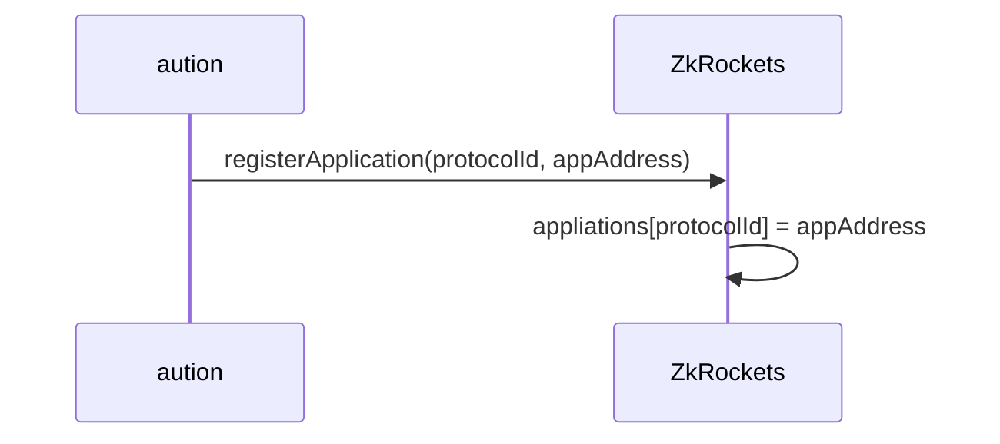
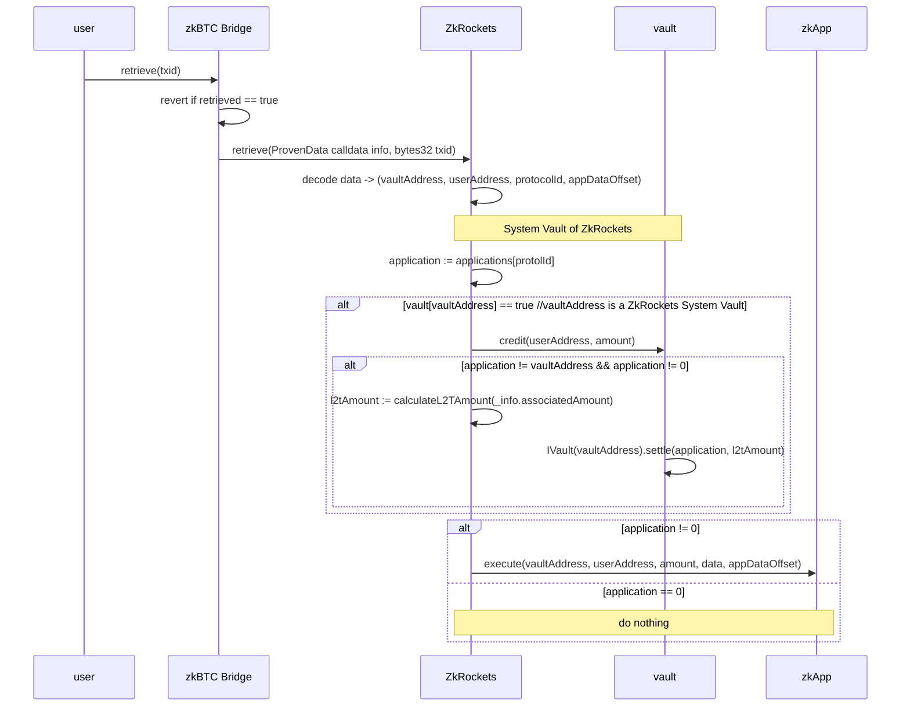

# ZenKeeper
The ZenKeeper Protocol is a cross-chain protocol for Bitcoin-based assets, based on the zkBTC bridge.

## the ZenKeeper Protocol and its Data Format
The [zkBTC Bridge](https://apps.zkbtc.money/?mode=bridge) enables users to bring bitcoin to Ethereum. User simply deposit to the designated operator address with an additional output:
```
OP_RETURN(0x6a) || 0x14(meaning 20 bytes to follow) || recipient_address_eth(20 bytes)
```
The `OP_RETURN` output simply contains user's recipient address for the minted zkBTC tokens. It should be the original address in 20 bytes, not hex-encoded or `0x-` prefixed.

When more data are encoded in the deposit transaction, we could prove these additional dato to some Ethereum smart contracts. This is the idea behind the ZenKeeper protocol. 

The ZenKeeper protocol defines three additional roles:
- `ZkRockets`: the smart contract that implements the ZenKeeper protocol and handles those cross-chain data;
- `Vaults`: the smart contracts that could manager users zkBTC assets;
- `Applications`: the smart contracts that could perform certain functionalities, identified by a protocol Id.

Now the `OP_RETURN` output should contain data in the below format:
```
                        ｜<----------------------------------ZkRockets-------------------------------------------------->|----Application Data------->
    fields:              OP_REURN     op_pushbytes_x    length      vaultAddress    chainId    protocolId    userAddress     appData
    length (in bytes):    1           1                 0/1/2/4        20            1           1+x             20             xxx 
```
- **op_pushbytes_x** and (optional) length: this is how data length is encoded in the `OP_RETURN` output. When data length is not more than 75 (bytes), the op_pushbytes_x along tells the actual length (`x`) of data that follows. Over 75, then 1 or 2 or 4 bytes are used to encode the actual length in little-endian fashion. See [op_return](https://learnmeabitcoin.com/technical/script/return/) and [data push](https://learnmeabitcoin.com/technical/script/#data) for more information.
- **vaultAddress**: this is actually the `recipient address in eth` when purely depositing. The zkBTC Bridge contract transfers the minted zkBTC tokens to this address, along with rewarded L2T. Although this happens out of `ZkRockets`'s scope, it is `ZkRockets`'s job to ensure the correct handling of users' assets. So the vault contracts must implement the `credit` and `settle` functions for these two purposes.
- **chainId**: ZkRockets supports multiple chains, and `0` means Ethereum.
- **protocolId**: the assigned Id for a vault or application. Follow the same encoding rules of [data push](https://learnmeabitcoin.com/technical/script/#data) and let `id` denote the protocolId value:
    - value in range 1~75: `1 byte of OP_PUSHBYTES_X with X := id`;
    - value in range 76~255: `0x4C || id`;
    - value in range 256~65535: `0x4D || id % 256 || id >> 8`;
    - value in range 65536~: `0x4E || id % 256 || (id>>8) % 256 || (id>>16) % 256 || id >> 24`.
- **userAddress**: user's recipient address
- **appData**: application data

## the ZkRockets Contract
The ZkRockets contract is called by the zkBTC Bridge contract:
```solidity 
 function retrieve(ProvenData calldata info, bytes32 txid) external onlyBridge;
```

For the purposes of: 
- parse the data encoded in the `OP_RETURN` output;
- if the address of a managed vault is present as `vaultAddress` (following the length codes) in the proven data, call the `credit` funciton to book-keep the owner of the bridged zkBTC as `userAddress`, and the `settle` function to forward the L2T rewards to the application identified in `protocolId`;
- invoke application's `execute` function.

Users are responsible for sending in the `OP_RETURN` data so users are ultimately responsible for their assets to be taken care of. All vault contracts must be open-sourced and carefully reviewed before it could be managed by the ZkRockets contract.

There are 3 possibilities for the `vaultAddress`:
   - system vault, managed by the ZkRockets contract;
   - application vault or the application itself;
   - user's own address.

In most cases, the `vaultAddress` and the `protocolId` refer to the same smart contract. Yet, user might, and ZkRockets allows to involve two seperate contracts at the same time: sending zkBTC tokens to one vault, then interact with another application. That's why all vaults must have `credit` and `settle` functions, and all applications must have `execute` function -- these functions serve different purposes.

Specifically:

- the `credit` function credit a proper amount of zkBTC to the `userAddress`;
- the `settle` function usually sends back the rewarded L2T to the application as identified by `protocolId`;
- the `execute` function performs whatever functionality defined by the application as identified by `protocolId`.

### zkRockets Workflows

#### Registering the ZkRockets Contract to zkBTC Bridge


#### Registering Applications to the ZkRockets Contract
- Aution

- Admin


#### Retrieval of Proven Data


## Vault
A Vault is a smart contract capable of managing zkBTC assets for users. A ZkRockets System Vault is a vault that is reviewed and registered to the ZkRockets contract.

During regular zkBTC Bridge operation (before retrieval of proven data), the minted zkBTC tokens have already been deposited to the `vaultAddress` (after deducting certains fees). This happens outside of the ZkRockets system. When the address of a ZkRockets Vault is specified as `vaultAddress`, then the ZkRockets contract has the chance to `credit` user for the amount. Also, it is the system design that the system valut must `settle` the rewarded L2T back to the intended application identified by `protocolId`.

```solidity
    function credit(address _to, uint256 _amount) onlyOperator external {
        require(_to != address(0), "Invalid recipient");
        require(_amount > 0, "Amount must be > 0");
        require (zkBTC.balanceOf(address(this)) >= _amount, "Vault balance too low");
        balances[_to] += _amount;
        emit Credit(_to, _amount);
    }

    function settle(address _to, uint256 _amount) onlyOperator external {
        require(_to != address(0), "Invalid recipient");
        require(_amount > 0, "Amount must be > 0");
        require (l2t.balanceOf(address(this)) >= _amount, "Vault balance too low");
        bool success = l2t.transfer(_to, _amount);
        require(success, "Transfer failed");
        emit Settle(_to, _amount);
    }

```

### Security
Access to both `credit` and `settle` functions should be restricted.

### Composability
Since the zkBTC Bridge contract has already deposited the minted zkBTC tokens to th `vaultAddress` (along with L2T rewards), the vault contracts must support asynchronous deposit. However, the semantic is slightly different from that of [ERC-7540](https://eips.ethereum.org/EIPS/eip-7540). It is advised that the vault could be implemented as an adaptor to another ERC-7540 vault.

## Application Contracts
Implement this function:
```solidity 
 function execute(address vaultAddress, addres userAddress, uint256 amount, Provendata data, uint8 appOffset) onlyOperator external;
```

### Security
Access to the `execute` function should be restricted.

The application, as identified by `protocolId`, may have or have not received the minted zkBTC, depending on whether the user has set the `vaultAddress` to the same contract or another one. Therefore if the application expects minted zkBTC from users, it must check if it has received such. It is application developer's responsibility to ensure asset security here.
