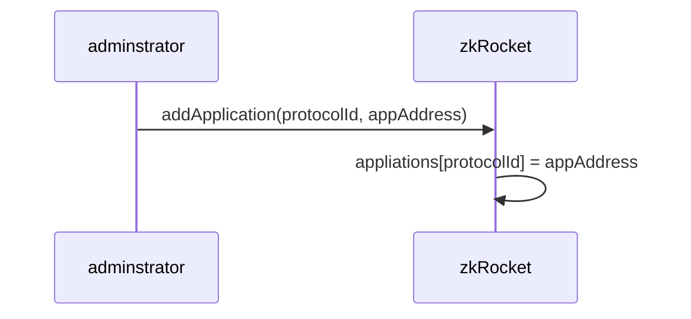

# ZenKeeper
The ZenKeeper Protocol, a protocol for Bitcoin-based assets, based on the zkBTC cross-chain capabilities.

## Vault 合约
Vault 是一个可托管zkBTC资产的金库合约，在deposit时，用于接收过桥的zkBTC 以及奖励的的LIT Token. 该合约提供一个claim接口，允许有特定权限的人(例如zkBridge)将资产从vault 转移到用户，或者在vault中为用户记账。
```solidity
function claim(address token, address to, uint256 amount, bool withdrawal){
   if(withdrawal) {
      bool success = IERC20(token).transfer(to, amount);
    }else{
      balances[token][to] += amount;
   }
}
```
## zkRockets 合约
zkRocket 处理deposit 交易中OP_RETURN 后的数据
```
                             |<-------------------------------zkRockets--------------------------------------->|----appData------->
    fields:       OP_REURN     opcode     length      addressA    chainId    protocolId   userOption addressB     appData
    length(bytes):    1           1       0/1/2/4        20            1           2          1          20         xxx 
```
- addressA: zkBridge 处理deposit时，将过桥的zkBTC 以及奖励的的LIT Token 直接转账到该地址.addressA 3种可能:
   - 用户地址. 此时用户不参与zkRockets 协议。
   - zkRocket 控制的vault 地址。
   - zkRocket 上的应用(例如zkRunes)控制的vault 地址。 
- chainId: 因为支持从BTC 跨链到多条EVM链，用chainId跨链的目标链，0-eth 
- userOption: true:用户参与Vault，在vault中为用户记账; fasle:用户不参与Vault, 需要将用户的zkBTC 转移到指定的addressB上。
- addressB: 用户指定的地址
- appData: zkRocket上的应用协议数据。

zkRocket 要实现如下 retrieve 接口：
```solidity 
 function retrieve(ProvenData calldata info) external;
```
### zkRockets 主要流程

#### 在zkBridge上注册 zkRockets 


#### 在zkRockets上注册应用协议



#### 用户调用zkBridge 的retrieve 函数，触发zkRockets 处理 


## zkRockets 的应用合约
应用合约要实现如下execute 接口：
```solidity 
 function execute(bytes calldata data) external;
```
