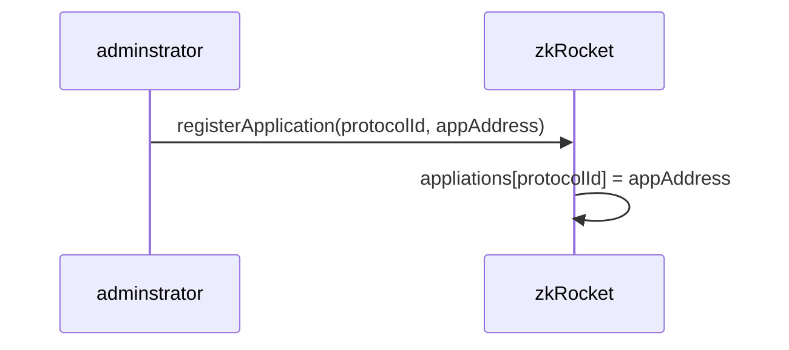
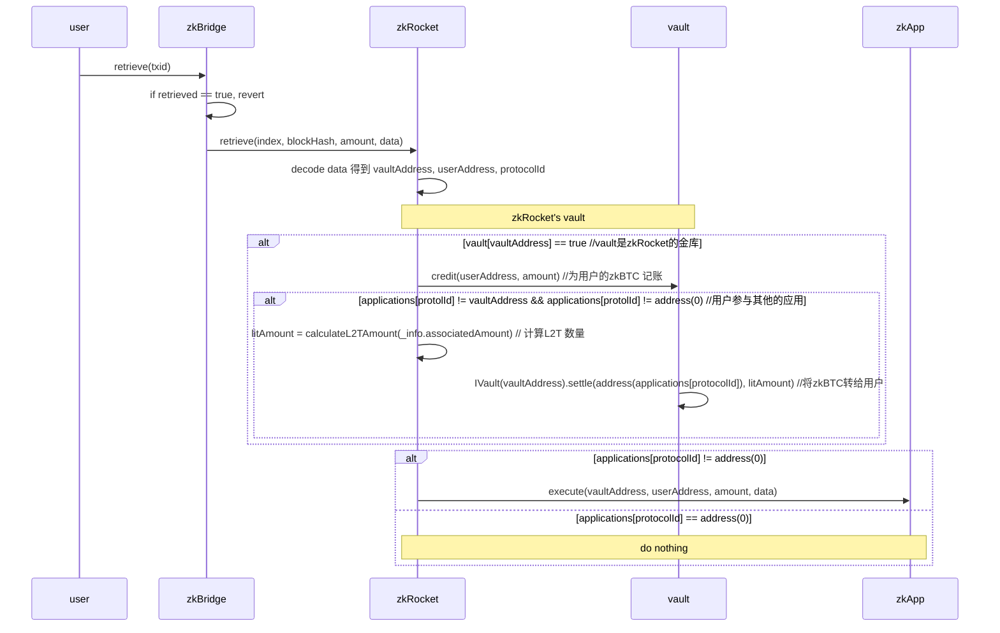

# ZenKeeper
The ZenKeeper Protocol, a protocol for Bitcoin-based assets, based on the zkBTC cross-chain capabilities.

## Vault 合约
Vault 是一个可托管zkBTC资产的金库合约，在deposit时，用于接收过桥的zkBTC 以及奖励的的L2T Token. 该合约提供一个credit和settle接口，
- credit：用于在vault合约中给用户zkBTC记账。
- settle：将vault合约中的L2T转移到别的地址
这两个接口应该只被有特定权限的合约访问，例如zkRocket 或者zkApp
```solidity
    function credit(address _to, uint256 _amount) onlyOperator external {
        require(_to != address(0), "Invalid recipient");
        require(_amount > 0, "Amount must be > 0");
        require (zkBTC.balanceOf(address(this)) >= _amount, "Vault balance too low");
        balances[_to] += _amount;
        emit Credit(_to, _amount);
    }

    function settle(address _to, uint256 _amount) onlyOperator external {
        require(_to != address(0), "Invalid recipient");
        require(_amount > 0, "Amount must be > 0");
        require (l2t.balanceOf(address(this)) >= _amount, "Vault balance too low");
        bool success = l2t.transfer(_to, _amount);
        require(success, "Transfer failed");
        emit Settle(_to, _amount);
    }

```
## zkRockets 合约
zkRocket 处理deposit 交易中OP_RETURN 后的数据
```
                   ｜<----------------------------------zkRockets--------------------------------->|----appData------->
    fields:       OP_REURN     opcode     length      addressA    chainId    protocolId    addressB     appData
    length(bytes):    1           1       0/1/2/4        20            1           2          20         xxx 
```
- addressA: zkBridge 处理deposit时，将过桥的zkBTC 以及奖励的的L2T Token 直接转账到该地址.addressA 3种可能:
   - 用户地址. 此时用户不参与zkRockets 协议。
   - zkRocket 控制的vault 地址。
   - zkRocket 上的应用(例如zkRunes)控制的vault 地址。 
- chainId: 因为支持从BTC 跨链到多条EVM链，用chainId跨链的目标链，0-eth 
- addressB: 用户指定的地址
- appData: zkRocket上的应用协议数据。

zkRocket 要实现如下 retrieve 接口：
```solidity 
 function retrieve(ProvenData calldata info,bytes32 txid ) external;
```
### zkRockets 主要流程

#### 在zkBridge上注册 zkRockets 


#### 在zkRockets上注册应用协议
- aution 在拍卖成功后可以在zkRocket上注册应用。

- zkRocket的adminstrator 也可以直接注册appliction



#### 用户调用zkBridge 的retrieve 函数，触发zkRockets 处理 

## zkRockets 的应用合约
应用合约要实现如下execute 接口：
```solidity 
 function execute(address vaultAddress, addres userAddress, uint256 amount, Provendata data) external;
```

## 测试
### 测试准备
- deploy zkBTC: 0xeda25EC9CF6BF1800174080CDBddb5779F2F2c1b
- deploy L2T: 0xF04be284E514e18aF2A69cAC6C8977967581E461
- deploy vault: 0xBa633eE041e1854bF42A69578028b247d180583D
- deploy tokenomics: 0x7C51d7D336aFdAc8E0beD39D5AAdCE49084dCb41
- deploy zkRocket: 0x8670c96804f6eB4CC6A5bea61d94Cf7e81EFd7cC
- deploy mokcApp1: 0x17730D1B29766d1Ff32D1b5554850061d9Ab8178
- deploy mockApp2: 0x8723BD7363bd2eD14ED1914512fAFc15F7D727C8
- deploy 盲盒: 
- zkRocket中添加 mockApp1, 协议代号1: https://sepolia.etherscan.io/tx/0x00a1646bea29780000d0370ec1c3acaf99534f4e646e786f9c8262ba57948a73
- zkRocket中添加 mockApp2， 协议代号2:  https://sepolia.etherscan.io/tx/0xe7242697502290aa1762434e2de69a06c2e927733875733f5c3b0d9782539783
- 将vault 增加到zkRocket中：https://sepolia.etherscan.io/tx/0xbfd26579bd070f4a77f4efa635638be5049538ce67328dd0caac579a90e0b5fa

- mint 1000 zkBTC to vault: https://sepolia.etherscan.io/tx/0x3233c69c6423af0e67e486d7ffecc7c70aed0fc9064ec042d1ff8b20e5ce98f8
- mint 128000 L2 to vault: https://sepolia.etherscan.io/tx/0x37ffda118a26003202f60afadaa68c431115c447fb0f73482e456234e982505c

- 将zkRocket 设置为vault 的OPERATOR_ROLE：https://sepolia.etherscan.io/tx/0xa0e0c41c5272449e5990b261dec04a466eac09e84ff1f3aef73da849007fa61d

- 将keep EOA owner 设置为zkRocket的BRIDGE_ROLE ：https://sepolia.etherscan.io/tx/0x5c810f55b4c3617fe0229bc42cf783579e63d7d88a81fc3efd41814bfd60d80f

- 将tong的EOA 设置为zkRocket的BRIDGE_ROLE ：
  https://sepolia.etherscan.io/tx/0x0155a865ee3fdaf5459485115c72c90fe3b93e1cce338093e9357bfe39aa2170
  
- 将tong的EOA 设置为zkRocket的ADMIN_ROLE ：
https://sepolia.etherscan.io/tx/0xf125bbb42d136644dd4550b029a0c7b4479baccf2ef7de19c07d1d9c0088b061  

### 测试用例(旧版本的测试用例)
#### 转到用户地址
```js
provenData {
  index: 1,
  blockHash: '0x82c68e42a344925588d5485ca1d910ea3e1f381dc9e9735d14e6574a7fc0518c',
  associatedAmount: 100000000n,
  data: '0x6a146Ee0a1f264d6690Fa6DeC24ADb78AC291dF33d74',
  retrieved: false
}
txid = "0x82c68e42a344925588d5485ca1d910ea3e1f381dc9e9735d14e6574a7fc0518c";
```
https://sepolia.etherscan.io/tx/0xe690cf43411dea0dc85c075c7fb249c9ab0c781fb51f51bdf964158ebe80bf56

#### 转移到vault地址，但是参与mockApp，
```js
provenData {
  index: 1,
  blockHash: '0x82c68e42a344925588d5485ca1d910ea3e1f381dc9e9735d14e6574a7fc0518c',
  associatedAmount: 100000000n,
  data: '0x6a2bBa633eE041e1854bF42A69578028b247d180583D0000016Ee0a1f264d6690Fa6DeC24ADb78AC291dF33d74',
  retrieved: false
}
txid = "0x82c68e42a344925588d5485ca1d910ea3e1f381dc9e9735d14e6574a7fc0518c";
```
https://sepolia.etherscan.io/tx/0xb8faf3ae9306368a10db82402f1200961725c6c9b51308bb3d930dff10dcad93

#### 转移到mockApp地址， mockApp 同时不是受zkRocket控制的vault ，
```js
provenData {
  index: 1,
  blockHash: '0x82c68e42a344925588d5485ca1d910ea3e1f381dc9e9735d14e6574a7fc0518c',
  associatedAmount: 100000000n,
  data: '0x6a2b131d73C228BfA36F81f15D3052E0a723427494b00000016Ee0a1f264d6690Fa6DeC24ADb78AC291dF33d74',
  retrieved: false
}
txid = "0x82c68e42a344925588d5485ca1d910ea3e1f381dc9e9735d14e6574a7fc0518c";
```
https://sepolia.etherscan.io/tx/0x77dde119340efc496b583d525e088259e8af2736b966697d2c69c1581d72b41f

#### 转移到mockApp地址， mockApp 同时是受zkRocket控制的vault，
- add mockApp2 as zkRocket's vault: https://sepolia.etherscan.io/tx/0xf65f3fbac1ff0d14d5cbf46f2070c14cd9ecbc5376cad77cd2c18dd1fb55631e
- register mockApp2 into zkRocket
https://sepolia.etherscan.io/tx/0xf52ea241c75b2cfb37ec254dbd97dd22d91af9c71d72554eba92b594bd351d8d   
- grant zkRocket as operator to mockApp2
https://sepolia.etherscan.io/tx/0x3d68e104961103541138a9838438337c42faf465bfb1da1af6e698be487afc11   
- mint zkBTC to mockApp2:https://sepolia.etherscan.io/tx/0x3971ad84e4ef3f9f5986675aeeb5c730bb259e85068a3b230ce8f53909df8259
- mint L2T to mockApp2:https://sepolia.etherscan.io/tx/0xdfd76e69c868b13fe4dd0a2cc66d91890334399ad5d0351baa26ff6be28d686f 
```js
provenData {
  index: 1,
  blockHash: '0x82c68e42a344925588d5485ca1d910ea3e1f381dc9e9735d14e6574a7fc0518c',
  associatedAmount: 100000000n,
  data: '0x6a2b891bA1E6c999333f8245BA275d61F391439E37B40000036Ee0a1f264d6690Fa6DeC24ADb78AC291dF33d74',
  retrieved: false
}
txid = "0x82c68e42a344925588d5485ca1d910ea3e1f381dc9e9735d14e6574a7fc0518c";
```
https://sepolia.etherscan.io/tx/0x156c464d1acb0dc57ecb2973a3f727c821d2f8efa3456ff59f465f54b871b7dd

